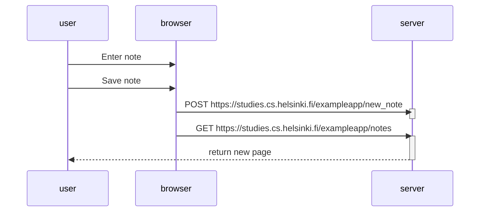

New Note Diagram:

```mermaid
sequenceDiagram
    participant user
    participant browser
    participant server

    user->>browser: Enter note
    user->>browser: Save note

    browser->>server: POST https://studies.cs.helsinki.fi/exampleapp/new_note
    activate server
    %% Note the server save a new note to the databse
    deactivate server

    browser->>server: GET https://studies.cs.helsinki.fi/exampleapp/notes
    activate server
    server-->>user: return new page
    deactivate server
```
